# Transmog

[](https://pypi.org/project/transmog/)
[](https://pypi.org/project/transmog/)
[](https://github.com/scottdraper8/transmog/blob/main/LICENSE)

Flatten nested JSON data into tabular formats while preserving parent-child relationships.

## Installation

```bash
# Standard install (includes Parquet and ORC support)
pip install transmog

# Minimal install (CSV output only)
pip install transmog[minimal]
```

## Quick Start

```python
import transmog as tm

data = {"user": "Alice", "orders": [{"id": 101}, {"id": 102}]}
result = tm.flatten(data, name="users")

result.main                    # Main table
result.tables["users_orders"]  # Child tables
result.save("output.csv")      # Save to file
```

**How it works:** Nested JSON is flattened into related tables with foreign key relationships:

```mermaid
%%{init: {'theme': 'dark', 'themeVariables': {
    'primaryColor': '#ff79c6',
    'secondaryColor': '#bd93f9',
    'tertiaryColor': '#44475a',
    'mainBkg': '#282a36',
    'nodeBorder': '#ff79c6',
    'clusterBkg': '#44475a',
    'clusterBorder': '#bd93f9',
    'textColor': '#f8f8f2'
}}}%%
flowchart LR
    subgraph Input["INPUT"]
        JSON["user: Alice
        orders: [
          • id: 101
          • id: 102
        ]"]
    end

    Input --> |flatten| ERD

    subgraph ERD["OUTPUT"]
        direction LR

        users["users
        ━━━━━━━━━━━━━━
        _id PK
        user
        _timestamp"]

        users_orders["users_orders
        ━━━━━━━━━━━━━━━━
        _id PK
        _parent_id FK
        id
        _timestamp"]

        users -->|1:N| users_orders
    end

    style Input fill:#44475a,stroke:#ff79c6,stroke-width:3px
    style ERD fill:#44475a,stroke:#bd93f9,stroke-width:3px
    style JSON fill:#282a36,stroke:#ff79c6,stroke-width:2px,color:#f8f8f2
    style users fill:#282a36,stroke:#50fa7b,stroke-width:2px,color:#f8f8f2
    style users_orders fill:#282a36,stroke:#8be9fd,stroke-width:2px,color:#f8f8f2
```



## Features

- Flatten nested JSON to CSV, Parquet, or ORC
- Smart array handling preserves simple arrays, extracts complex arrays to child tables
- Read JSON, JSON Lines, JSON5, HJSON files
- Stream processing for large datasets
- Configurable ID generation strategies

## API

**flatten(data, name, config)** — Flatten data in memory

```python
result = tm.flatten("data.json", name="products")
result = tm.flatten([{"id": 1}, {"id": 2}])
result.save("output.parquet")
```

**flatten_stream(data, output_path, name, output_format)** — Stream directly to disk

```python
tm.flatten_stream("large.jsonl", "output/", name="events", output_format="parquet")
```

## Configuration

```python
config = tm.TransmogConfig(
    array_mode=tm.ArrayMode.SMART,   # SMART, SEPARATE, INLINE, SKIP
    id_generation="random",          # random, natural, hash, or ["field1", "field2"]
    id_field="_id",
    parent_field="_parent_id",
    time_field="_timestamp",
    include_nulls=False,
    max_depth=100,
    batch_size=1000
)

result = tm.flatten(data, config=config)
```

### Array Modes

| Mode | Behavior |
|------|----------|
| `SMART` | Preserve simple arrays, extract complex arrays to child tables |
| `SEPARATE` | Extract all arrays to child tables |
| `INLINE` | Serialize arrays as JSON strings |
| `SKIP` | Omit arrays from output |

### ID Generation

| Strategy | Description |
|----------|-------------|
| `random` | Generate random UUID (default) |
| `natural` | Use existing ID field from data |
| `hash` | Deterministic hash of entire record |
| `["field1", ...]` | Deterministic hash of specified fields |

## Documentation

Full documentation: [scottdraper8.github.io/transmog](https://scottdraper8.github.io/transmog)

- [Getting Started Guide](https://scottdraper8.github.io/transmog/getting_started.html)
- [User Guide](https://scottdraper8.github.io/transmog/user_guide/file-processing.html)
- [API Reference](https://scottdraper8.github.io/transmog/api_reference/api.html)
- [Developer Guide](https://scottdraper8.github.io/transmog/developer_guide/contributing.html)

## License

MIT License - see [LICENSE](LICENSE) file for details.
